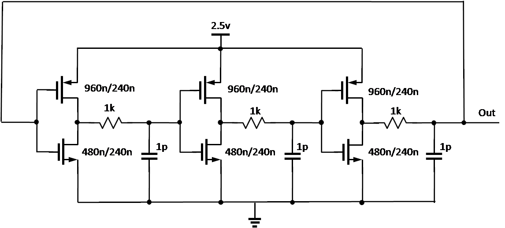

# GROUP MINI PROJECT FROM IC DESIGN CLASS

## 1. Goal

Our goal is to create and simulate a ring oscillator that has the $t_{period}=10ns$ & duty cycle $=50\%$ using a programme called *ngspice*

## 2. Ring Oscillator & Design

According to [Wikipedia](https://en.wikipedia.org/wiki/Ring_oscillator), a ring oscillator is a device composed of an odd number of NOT gates in a ring, whose output oscillates between two voltage levels, representing true and false. The NOT gates, or inverters, are attached in a chain and the output of the last inverter is fed back into the first.

.png)

Our design of a ring oscillator will be similar to this:

The value of resistors and capacitors will be re-calculated to fit the goal.

If t represents the time delay for a single inverter and n represents the number of inverters in the inverter chain, then the frequency of oscillation is given by: $f=\frac{1}{2tn}$